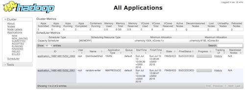

# Hadoop cluster with 1 master and 3 nodes

The objective of this use case is to deploy a complete Hadoop cluster, at the [Managed Cloud Platform from Dimension Data](http://cloud.dimensiondata.com/eu/en/).
This is done with [plumbery](https://developer.dimensiondata.com/display/PLUM/Plumbery) and a template that is provided below.

With this use case we prepare a ready-to-use HDFS and YARN cluster with multiple nodes. The master is running
the HDFS naming service and the YARN resource manager service. Other nodes store HDFS data and provide running containers to YARN.

## Requirements for this use case

* Select a MCP location
* Add a Network Domain
* Add an Ethernet network
* Deploy multiple Ubuntu servers
* Provide enough CPU, RAM and disk to each node, as defined by parameters
* Monitor nodes in the real-time dashboard provided by Dimension Data
* Assign a public IPv4 address to each node
* Add address translation to ensure end-to-end IP connectivity
* Add firewall rule to accept TCP traffic for ssh and for web consoles
* Expand system storage (LVM) with additional disk
* Update the operating system
* Synchronise node clock with NTP
* Install a new SSH key to secure remote communications
* Configure SSH to reject passwords and to prevent access from root account
* Update `etc/hosts` and `hostname` to bind network addresses to host names
* Install Java and Hadoop (HDFS and YARN)
* Run test commands to validate the setup

## Fittings plan

[Click here to read fittings.yaml](fittings.yaml)

## Deployment command

    $ python -m plumbery fittings.yaml deploy

This command will build fittings as per the provided plan, start the server
and bootstrap it. Look at messages displayed by plumbery while it is
working, so you can monitor what's happening.

## Follow-up commands

At the end of the deployment, plumbery will display on screen some instructions
to help you move forward. You can ask plumbery to display this information
at any time with the following command:

    $ python -m plumbery fittings.yaml information

In this use case you can use the IPv4 assigned to the master node for direct ssh
connection.

    $ ssh ubuntu@<ipv4_here>

You will have to accept the new host, and authentication will be based on
the SSH key communicated to the node by Plumbery.

To test HDFS you can for example create a directory and copy some files:

    $ sudo su
    # . /etc/profile.d/hadoop.sh
    # hdfs dfs -ls /
    # echo "Hello world" | cat >world.txt
    # hdfs dfs -mkdir /test2
    # hdfs dfs -copyFromLocal world.txt /test2
    # hdfs dfs -copyFromLocal world.txt /test2/world2.txt
    # hdfs dfs -ls /test2
    # hdfs dfs -rm /test2/*
    # hdfs dfs -rmdir /test2

To test MapReduce you can run the script that is already provided. This will take
some minutes to complete:

    # ./test_mapreduce.sh

Same approach to test YARN:

    # ./test_yarn.sh

Go with your preferred browser to the NamedNode HDFS web console,
using the link provided by plumbery. You should get something like the following:

With the other link you can visit the YARN web console. This will provide you
with a clear view on on-going container operations:

## Destruction commands

Launch following command to remove all resources involved in the fittings plan:

    $ python -m plumbery fittings.yaml dispose

## Use case status

- [x] Work as expected

## See also

- [Analytics with plumbery](../)
- [All plumbery fittings plans](../../)

