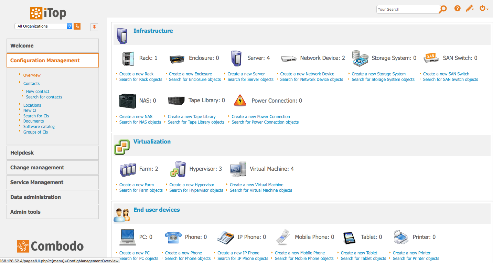

# iTop Community from Combodo, for open-source ITSM

The objective of this use case is to deploy iTop on a single node, at the [Managed Cloud Platform from Dimension Data](http://cloud.dimensiondata.com/eu/en/).
This is done with [plumbery](https://developer.dimensiondata.com/display/PLUM/Plumbery) and a template that is provided below.

This use case will be useful to companies looking for an open source solution
that fosters ITIL best practices: [iTop Community, from Combodo](http://www.combodo.com/itop-193).

## Requirements for this use case

There are a number of actions involved in the overall deployment, and plumbery
will assist to orchestrate all of them, except the online setup of iTop:

* Select a MCP location
* Add a Network Domain
* Add an Ethernet network
* Deploy a Ubuntu server
* Provide 2 CPU and 4 MB of RAM
* Add a virtual disk of 50 GB
* Monitor this server in the real-time dashboard provided by Dimension Data
* Assign a public IPv4 address
* Add address translation to ensure end-to-end IP connectivity
* Add firewall rule to accept TCP traffic on port 22 (ssh) and 80 (web)
* Combine virtual disks into a single expanded logical volume (LVM)
* Update the operating system of each node
* Synchronise node clock of each node
* Install a new SSH key to secure remote communications
* Configure SSH to reject passwords and to prevent access from root account
* Update `etc/hosts` to bind addresses to host names
* Download multiple packages, including Apache, PHP, MySQL
* Install MySQL
* Download and install iTop

## Fittings plan

[Click here to read fittings.yaml](fittings.yaml)

## Deployment command

    $ python -m plumbery fittings.yaml deploy

This command will build fittings as per the provided plan, start the server
and bootstrap it. Look at messages displayed by plumbery while it is
working, so you can monitor what's happening.

## Follow-up commands

At the end of the deployment, plumbery will display on screen some instructions
to help you move forward. You can ask plumbery to display this information
at any time with the following command:

    $ python -m plumbery fittings.yaml information

Final step is to connect to iTop in a web browser, and to complete the setup
online.

## Destruction commands

Launch following command to remove all resources involved in the fittings plan:

    $ python -m plumbery fittings.yaml dispose

## Use case status

- [ ] Work as expected

## See also

- [Application services with plumbery](../)
- [All plumbery fittings plans](../../)

