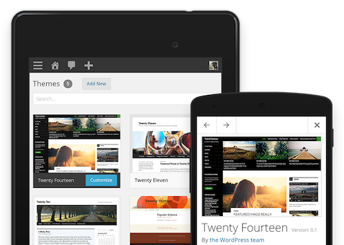

# WordPress blogging server

The objective of this use case is to deploy a Stackstorm server, at the [Managed Cloud Platform from Dimension Data](http://cloud.dimensiondata.com/eu/en/).
This is done with [plumbery](https://developer.dimensiondata.com/display/PLUM/Plumbery) and a template that is provided below.

[WordPress](https://wordpress.org/) is web software you can use to create a beautiful website, blog, or app.
The community that has created it say that WordPress is both free and priceless at the same time.

## Requirements for this use case

* Select a MCP location
* Add a Network Domain
* Add an Ethernet network
* Deploy a Ubuntu node
* Provide 2 CPU and 4 GB of RAM
* Add a virtual disk of 50 GB
* Monitor this server in the real-time dashboard provided by Dimension Data
* Assign a public IPv4 address
* Add address translation to ensure end-to-end IP connectivity
* Add firewall rule to accept TCP traffic on port 22 (ssh), 80 (web)
* Combine the virtual disks into a single expanded logical volume (LVM)
* Update the operating system
* Synchronise node clock with NTP
* Install a new SSH key to secure remote communications
* Configure SSH to reject passwords and to prevent access from root account
* Install Apache2 and PHP
* Install MySQL and create a first database
* Install WordPress

## Fittings plan

[Click here to read fittings.yaml](fittings.yaml)

You can note how SQL instructions are transmitted to the server
directly from within fittings plan.

## Deployment command

    $ python -m plumbery fittings.yaml deploy

This command will build fittings as per the provided plan, start the server
and bootstrap it. Look at messages displayed by plumbery while it is
working, so you can monitor what's happening.

## Follow-up commands

At the end of the deployment, plumbery will display on screen some instructions
to help you move forward. You can ask plumbery to display this information
at any time with the following command:

    $ python -m plumbery fittings.yaml information

Open a browser window and paste the public address reported by plumbery.
This should display the setup page of WordPress. Paste secrets (name and password)
that were displayed by plumbery previously. Enjoy WordPress!

## Destruction commands

Launch following command to remove all resources involved in the fittings plan:

    $ python -m plumbery fittings.yaml dispose

## Use case status

- [ ] Work as expected

## See also

- [Application services with plumbery](../)
- [All plumbery fittings plans](../../)

