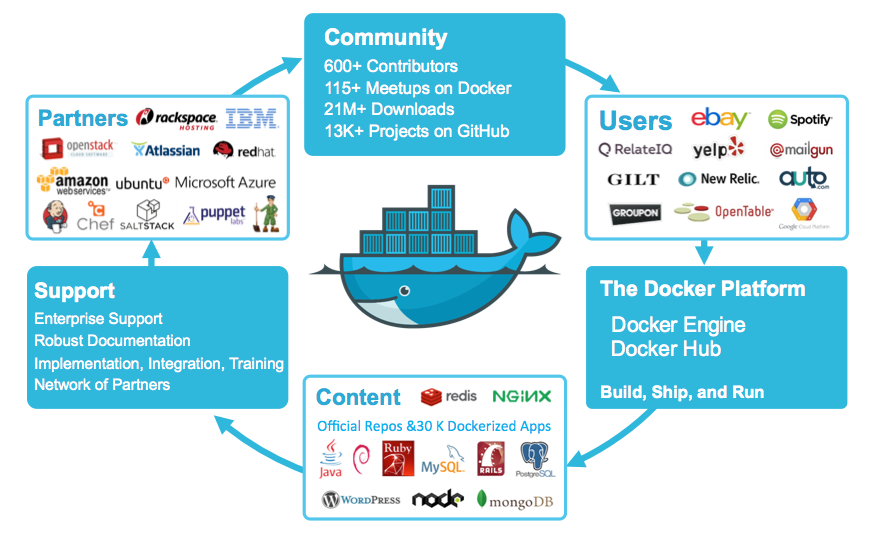

# Docker node

The objective of this use case is to deploy Docker Engine on a single node, at the [Managed Cloud Platform from Dimension Data](http://cloud.dimensiondata.com/eu/en/).
This is done with [plumbery](https://developer.dimensiondata.com/display/PLUM/Plumbery) and a template that is provided below.

Despite the surging interest in containers, the community is still struggling
on the proper setup of a Docker node. There are a number of things to look at,
including the network and the security.

In this use case we demonstrate how to create a class of Docker nodes and deploy
one single node. Of course, you can use this file for yourself, and change it
to better accomodate your requirements. For example, duplicate the last section
of this fittings plan and mention other data centres and regions.

## Requirements for this use case

* Select a MCP location
* Add a Network Domain
* Add an Ethernet network
* Deploy a large Ubuntu server
* Provide 32 CPU and 256 MB of RAM to each node
* Add a virtual disk of 100 GB
* Monitor this server in the real-time dashboard provided by Dimension Data
* Assign a public IPv4 address
* Add address translation to ensure end-to-end IP connectivity
* Add firewall rule to accept TCP traffic on port 22 (ssh)
* Combine the virtual disks into a single expanded logical volume (LVM)
* Update the operating system of each node
* Synchronise node clock of each node
* Install a new SSH key to secure remote communications
* Configure SSH to reject passwords and to prevent access from root account
* Update `etc/hosts` and `hostnames` to bind IPv6 addresses to host names
* Install Docker
* Allow non-root account to use Docker

## Fittings plan

[Click here to read fittings.yaml](fittings.yaml)

## Deployment command

    $ python -m plumbery fittings.yaml deploy

This command will build fittings as per the provided plan, start the server
and bootstrap it. Look at messages displayed by plumbery while it is
working, so you can monitor what's happening.

## Follow-up commands

At the end of the deployment, plumbery will display on screen some instructions
to help you move forward. You can ask plumbery to display this information
at any time with the following command:

    $ python -m plumbery fittings.yaml information

In this use case you can use the IPv4 assigned to the node for direct ssh
connection.

    $ ssh ubuntu@<ipv4_here>

You will have to accept the new host, and authentication will be based on
the SSH key communicated to the node by Plumbery.

    $ docker run hello-world

## Destruction commands

Launch following command to remove all resources involved in the fittings plan:

    $ python -m plumbery fittings.yaml dispose

## Use case status

- [x] Work as expected
- [ ] Document ssh tunneling to the Docker Engine over the Internet
- [ ] How to integrate this with Docker Machine?

## See also

- [Containers with plumbery](https://github.com/DimensionDataCBUSydney/plumbery-contrib/tree/master/containers)
- [All plumbery fittings plans](https://github.com/DimensionDataCBUSydney/plumbery-contrib/tree/master/fittings)

