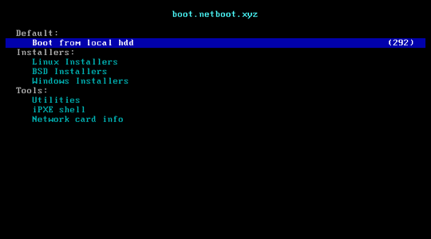

# Select your operating system installer with netboot.xyz and iPXE (experimental)

Via boot you have the option to select the operating system of your choice, deployed at the [Managed Cloud Platform from Dimension Data](http://cloud.dimensiondata.com/eu/en/).
This is done with [plumbery](https://developer.dimensiondata.com/display/PLUM/Plumbery) and a template that is provided below.

Warning: this use case is provided only for experimentations. At this point in
time Debian is not supported by Dimension Data.

The idea is to deploy a small Ubuntu node first, and then to install iPXE to
reboot over the wire. For this a small DHCP and TFTP server is
provided separately. During the boot sequence the loader provided by netboot.xyz is loaded and executed.

## Requirements for this use case

* Select a MCP location
* Add a Network Domain
* Add an Ethernet network
* Deploy a Ubuntu node
* Download iPXE and make it the default choice for node boot
* Configure iPXE to get network configuration and to boot over the network
* Deploy a Ubuntu node to act as DHCP and HTTP server on the VLAN
* Monitor this server in the real-time dashboard provided by Dimension Data
* Assign a public IPv4 address
* Add address translation to ensure end-to-end IP connectivity
* Add firewall rule to accept TCP traffic on port 22 (ssh)
* Install and configure DNSMASQ to bootstrap the other nodes (DHCP and TFTP)
* Install and expose files the loader from netboot.xyz

## Fittings plan

[Click here to read fittings.yaml](fittings.yaml)

## Deployment command

    $ python -m plumbery fittings.yaml deploy

This command will build fittings as per the provided plan, start the server
and bootstrap it. Look at messages displayed by plumbery while it is
working, so you can monitor what's happening.

## Follow-up commands

At the end of the deployment, plumbery will display on screen some instructions
to help you move forward. You can ask plumbery to display this information
at any time with the following command:

    $ python -m plumbery fittings.yaml information

Since no network information is given to the node, it cannot be
accessed over the Internet. The only way to login to the machine is to use the
console access, via the Cloud Control web user interface.

## Troubleshooting

This use case is purely experimental, and has the only merit to demonstrate
how different building blocks can be orchestrated to run a custom iPXE boot on the MCP.

## Destruction commands

Launch following command to remove all resources involved in the fittings plan:

    $ python -m plumbery fittings.yaml dispose

## Use case status

- [X] Work as expected

## See also

- [Example configurations with plumbery](../)
- [All plumbery fittings plans](../../)

