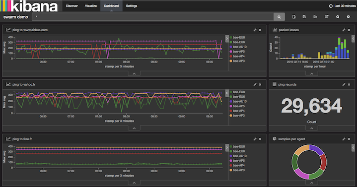
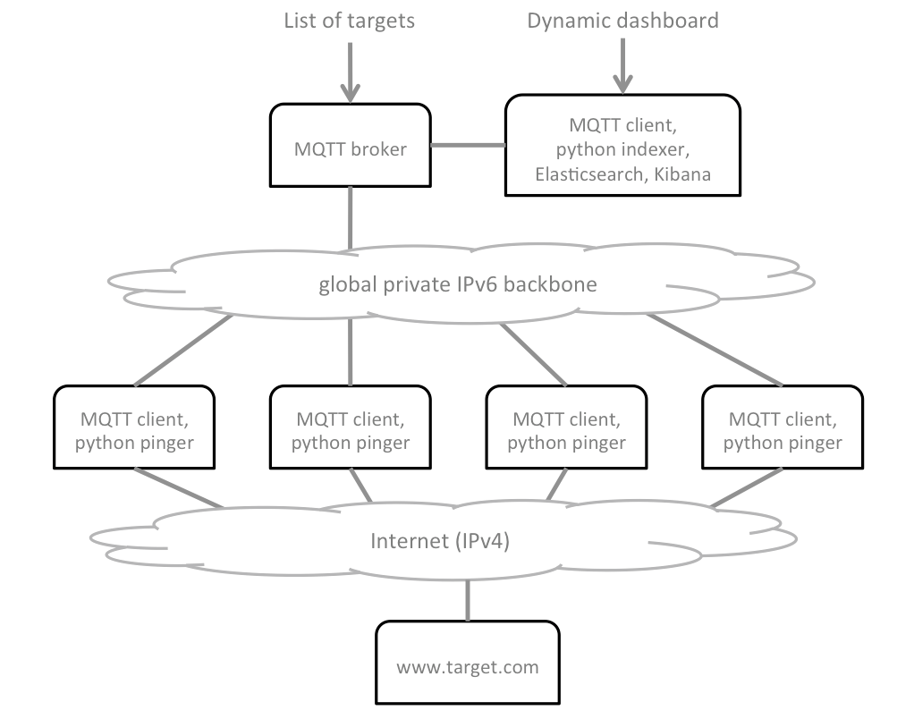

# Swarm of pingers connected to a MQTT broker and to a Kibana dashboard

The objective of this use case is to deploy a swarm of network pingers at
multiple data centres, at the [Managed Cloud Platform from Dimension Data](http://cloud.dimensiondata.com/eu/en/).
This is done with [plumbery](https://developer.dimensiondata.com/display/PLUM/Plumbery) and a template that is provided below.

MQTT is used across the swarm to coordinate the pingers
and to consolidate data. The back-end IPv6 infrastructure provided by
Dimension Data is used to streamline MQTT traffic across agents and broker,
in a secured backbone. Ping results are recorded in a centralised
Elasticsearch server, and shown in a Kibana interactive dashboard.

The network
and security services coming with cloud services from Dimension Data are used
to control access and to secure remote access to various building blocks of the
architecture.

Project credits: [Swarming project from Mathieu Lecarme](https://github.com/athoune/swarming)

## Requirements for this use case

The diagram below provides some essential understanding of the architecture
to be deployed:

There are a number of actions involved in the overall deployment, and plumbery
will assist to orchestrate all of them, except the custom configuration of the Kibana dashboard:

* Select multiple MCP locations
* Create a Network Domain at each location
* Create an Ethernet network at each location
* Deploy a MQTT broker in the focus data centre -- the queen
* Deploy an Elasticsearch & Kibana server in the same data centre -- the dashboard
* Deploy pinger nodes in multiple data centres world-wide -- the bees
* Add a virtual disk of 50 GB to the dashboard node
* Allow IPv6 traffic between MQTT clients (the bees) and the broker (the queen)
* Monitor all nodes in the real-time dashboard provided by Dimension Data
* Assign public IPv4 addresses to each node
* Add address translation to ensure SSH access to the nodes from the internet
* Add firewall rules to accept TCP traffic on port 22 (ssh)
* Add firewall rule to allow web traffic to the dashboard server
* Expand file system of the dashboard node with added disk (LVM)
* Update the operating system of each node
* Synchronise node clock of each node
* Install a new SSH key to secure remote communications across all nodes
* Configure SSH to reject passwords and to prevent access from root account
* Update `etc/hosts` and `hostnames` to bind IPv6 addresses to host names
* Install MQTT server at the queen node
* Install MQTT client software at bees and at the dashboard
* Install git to get python software from GitHub
* Install pinging software at bee nodes
* Install indexer software at the dashboard node
* Install Elasticsearch and Kibana at the dashboard node
* Feed the list of addresses to ping at the queen node
* Configure Kibana to deliver the visual reporting dashboard

## Fittings plan

The plan below demonstrates multiple interesting tips and tricks:

* Provide SSH access to all nodes via public IPv4, NAT, and firewall settings
* Management of SSH keys to enable secured communications without passwords
* Allow private IPv6 communications between remote data centres and the focus data centre
* Automatic registration of all nodes to the monitoring services provided by Dimension Data
* Update of `etc/hosts` with IPv6
* Install swarming software in python directly from GitHub repository
* Turn a python command to a service that can be started and stopped on-demand
* Remove Apache, and install Nginx instead
* Install an interactive dashboard with Elasticseach and Kibana
* Configure Nginx as efficient and secured proxy to Kibana
* Orchestrate generation and configuration of web password to the dashboard
* Automate the installation of Oracle 8 JDK
* User documentation of the infrastructure is put directly in the fittings plan

[Click here to read fittings.yaml](fittings.yaml)

## Deployment command

For this use case plumbery has to connect separately to multiple data centres
and to apply several changes in multiple waves.

    $ python -m plumbery fittings.yaml deploy

This command will build fittings as per the provided plan, and start
servers as well. Look at messages displayed by plumbery while it is
working, so you can monitor what's happening.

## Follow-up commands

At the end of the deployment, plumbery will display on screen some instructions
to help you move forward. You can ask plumbery to display this information
at any time with the following command:

    $ python -m plumbery fittings.yaml information

What's coming next? You may want to connect to the queen node in ssh and
check the stream of records coming from pingers to the broker via MQTT.

    $ ssh ubuntu@<IPv4 of queen node>

Subscribe to the MQTT stream from the command line like this:

    $ mosquitto_sub -t "ping/+" -v

After some seconds you will see records popping up from various parts of the world.

Now, let's move to the dashboard server to check the feeding of the elasticsearch
server.

    $ ssh ubuntu@<IPv4 of dashboard node>

From there you can validate the number of records in the index named 'swarm'
with the following command:

    $ curl 'http://localhost:9200/_cat/indices?v'

Repeat the command multiple times and check the increment of documents indexed
by Elasticsearch.

If everything is looking fine at this stage, then you are allowed to move
to the configuration of the Kibana interactive dashboard. In a browser window,
type the public IPv4 address of the dashboard server. When asked for it, provide
the name and the password that were mentioned by plumbery during the deployment
of the fittings plan.

From there you can select the 'swarm' index and configure the dashboard as per your
very specific needs.

## Destruction commands

Launch following command to remove all resources involved in the fittings plan:

    $ python -m plumbery fittings.yaml dispose

## Use case status

- [x] Work as expected

## See also

- [Logging with plumbery](https://github.com/DimensionDataCBUSydney/plumbery-contrib/tree/master/logging)
- [All plumbery fittings plan](https://github.com/DimensionDataCBUSydney/plumbery-contrib/tree/master/fittings)

